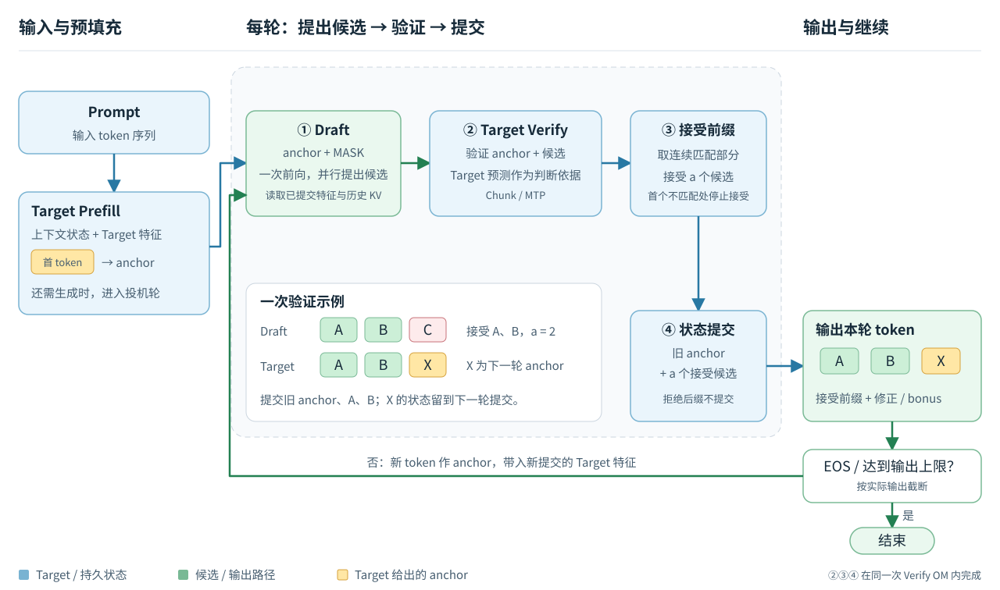

# 整体架构

Target 负责最终预测与验证；Draft 使用 Target 隐藏特征，一次提出最多 15 个候选。
[配置与测试](USAGE.md) · [测试结果](RESULTS.md) · [未来优化](OPTIMIZATION.md)

## 模型组成

| 项目 | Target | FP16 Draft | W4A16 / W8A16 Draft |
|---|---|---|---|
| 层数 | 32：24 Gated DeltaNet + 8 full attention | 6 | 5 |
| hidden | 2560 | 2560 | 2560 |
| MLP intermediate | — | 9216 | 9728 |
| 选定 Target feature 宽度 | — | 20480 | 12800 |
| Draft Q / KV heads；head dim | — | 32 / 8；128 | 32 / 8；128 |
| OM 精度 | W8A8，输出 FP16 | FP16 | group-128 权重，激活与 scale FP16 |

三种 Draft 是不同 checkpoint，层数和特征选择不同，不能视为只改变 bitwidth 的对照。
统一 Target 输出零起始层号 `[1,5,8,9,13,15,17,21,22,25,29]` 的特征并集，
每 token 28160 维；各 Draft 按自己的层号选列。Draft 共享完整 FP16 embedding / LM head，词表 248320。

## 一轮生成与状态提交

anchor 已输出，但其状态待本轮提交；零接受仍提交旧 anchor。
图中接受判断与状态提交均在同一次 Verify OM 内完成。

| 验证方式 | GDN 计算 | 接受 a 个候选后的状态 |
|---|---|---|
| Chunk | 第一遍计算整块；第二遍从本轮初始状态重算 | 提交 a+1 行 |
| MTP | 一次计算整块与逐行 state bank | 选择 bank 第 a 槽 |

GDN recurrent state 为 FP32，conv/KV 为 FP16。拒绝后的 recurrent state 不能靠截短 KV 撤销；
Verify 在 OM 内完成接受判断和状态提交，无独立 Commit OM。
ordinary Target 是 strict greedy 的权威，性能测量允许输出差异不代表通过一致性验证。

## Draft 数据流

参照 [DFlash 论文图 2](https://arxiv.org/pdf/2602.06036#page=4) 绘制，尺寸采用本项目配置。
图中为 FP16 六层版；W4A16 / W8A16 为五层，选定 Target 特征宽度为 12800，其余结构对应上表。

同一 FC 结果供各层 context K/V 使用；context 支路不依赖上一层 block hidden。
持久 KV 只保存已提交上下文，anchor/MASK block 的 KV 是临时值。
K/V、gate/up 已分别合并投影；每次量化 Draft 共 26 次 WeightQuant 和一次 FP16 head MatMul。

OM 的 QK/PV 使用 FP16 操作数，缩放、mask、softmax 为 FP32，PV 前概率转回 FP16。
原生 Torch-NPU Draft 的 QK/PV 为 FP32，两条路径的舍入可能不同。

## AIR / OM 与运行时

| 角色 | 文件 | 行数 / 作用 |
|---|---|---|
| Target Prefill | `prefill.om` | 64 行物理块处理 prompt |
| ordinary Decode | `decode.om` | 单行 greedy |
| Draft | `draft.om` / `draft_w4a16.om` / `draft_w8a16.om` | C16/C64 context + 固定 16 行 block |
| W8 离线 NZ 的 C64 档 | `draft_w8a16_static64.om` | 与 W8 C16 档共享运行时状态 |
| Verify | `verify_chunk.om` / `verify_mtp.om` | 固定 16 行，按有效长度验证与提交 |

`runtime` 权重模式由图内 TransData 转 NZ；W4 先将 packed byte 无损展开为 INT8。
`nz` 模式在 AIR 导出时离线转换 W8 权重并嵌入常量，编译器自动生成 C16/C64 两个静态 OM。
选全部 Draft 和两条 Verify 时，runtime 模式共 7 个 OM，W8 离线 NZ 模式共 8 个。

普通模式加载 Prefill/Decode；DFlash 加载 Prefill、选定 Draft、选定 Verify。
Target 图在 Draft 间共享，Draft 在两条 Verify 间共享；由部署清单选择文件，同一个 C++ runner 执行。
静态 W8 两档各自的模型常量和 workspace 计入显存，current/next KV 缓冲区共用。

非末尾 prompt 块调用 Draft 建立 context KV，候选丢弃；最后一块随首次生成处理。
输入 N token 有 `ceil(N/64)-1` 次准备调用；之后每轮新提交特征不超过 16 行。
`--low-memory` 顺序加载普通/DFlash 组，并复用串行 workspace。

## 源码入口

| 位置 | 职责 |
|---|---|
| [modeling_dflash.py](../models/dflash_v1/modeling_dflash.py) | Draft 模型与层 |
| [draft_quantization.py](../models/dflash_v1/draft_quantization.py) | checkpoint、量化 code 与 scale |
| [incremental.py](../framework/python/qwen35_dflash/ascend310p/incremental.py) | Prefill / Decode / Draft / Verify 图与 ABI |
| [cli.py](../framework/python/qwen35_dflash/ascend310p/cli.py) | AIR 导出、OM 编译与 runner 构建 |
| [acl_chunk.cpp](../framework/runtime/cpp/src/acl_chunk.cpp) | AscendCL 执行、档位选择与状态管理 |
| [benchmark_gdr_lengths.py](../tools/benchmark_gdr_lengths.py) | 统一测试与汇总 |
