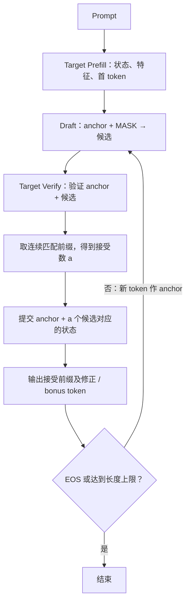
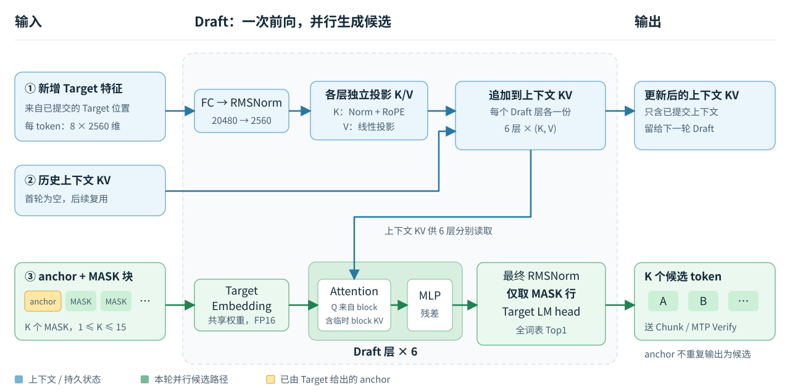

# DFlash 流程与架构

Target 负责验证和最终预测，Draft 利用 Target 的隐藏特征，一次提出最多 15 个候选。
两种验证路线都支持 Torch-NPU 和 OM/C++；命令见 [Torch-NPU](DFLASH_RUN_AND_VALIDATE.md)、
[OM/C++](GDR_CHUNK_AIR_OM.md)。

## 一轮怎样运行

anchor 是已输出、尚待本轮写入状态的 token。若候选为 `A B C`、Target 判断为
`A B X`，接受 2 个候选并输出 `A B X`；提交旧 anchor、A、B 的状态，X 留作下轮 anchor。
零接受仍提交旧 anchor，并继续投机。拒绝位置之后的预测不属于已提交序列。

## 模型组成

| 部分 | 结构 |
|---|---|
| Target | Qwen3.5-4B，32 层：24 层 Gated DeltaNet + 8 层 full attention；隐藏维度 2560 |
| Target 特征 | 第 1、5、9、13、17、21、25、29 层输出（从 0 编号），拼成每 token 20480 维 |
| Draft | 官方 6 层模型；FC 20480 → 2560，norm，各层上下文 K/V 投影，6 层 attention/MLP，LM head |
| Draft 输入 | 新提交的 Target 特征 + anchor/MASK block；持久 KV 只保留已提交上下文 |
| 精度 | 原生 Target 可选 FP16/W8A8；当前 OM 为 W8A8 Target + FP16 Draft |

OM Draft 的 QK/PV 矩阵乘默认 FP16，缩放、Mask、Softmax 为 FP32；
原生 Torch-NPU Draft 使用 FP32 矩阵乘。两者不能视为完全相同的数值路径。

## Draft 内部流程

参照 [DFlash 官方图 2](https://arxiv.org/pdf/2602.06036#page=4) 的
“Target 特征注入各层 KV、MASK 块并行生成”结构，按本仓库的 6 层 Draft 重画。
**从左向右看：绿色主线生成候选，蓝色支路提供上下文。**

- **输入**：新增 Target 特征、历史上下文 KV、`anchor + K 个 MASK`；anchor 是 Target 上次给出的最后一个 token。
- **输出**：一次前向得到 K 个候选及更新后的上下文 KV。只有 MASK 行生成候选，随后交给 Chunk 或 MTP Verify。
- **跨轮缓存**：首次加入 prompt 特征；之后加入上一轮旧 anchor 和接受前缀的 Target 特征。
  本轮 block 的临时 KV 不留到下一轮；零接受也加入旧 anchor 的特征。

算子与 OM 接口细节

同一份 FC/RMSNorm 结果供 6 层分别生成上下文 K/V；Query 只来自 anchor/MASK block。
每层内部为 RMSNorm → Q/K/V 投影（Q/K norm + RoPE）→ Attention → 输出投影与残差，
再经 RMSNorm → SwiGLU MLP 与残差。滑窗层按因果窗口计算，full-attention 层允许块内双向注意。

Chunk/MTP 共用同一个 `draft.om`，把上下文更新和候选生成合在一次调用中。
逻辑接口为 `(features, start_position, valid_rows, anchor, proposal_count, 历史 KV)`
→ `(候选 token, 更新后的 KV)`，位置和有效长度控制可见范围。
OM 固定使用紧凑 Draft：特征接口物理 64 行，生成只投影前 16 行，block 为 16 行。
这里 64 是 Prefill/Verify 共用的特征缓冲区容量，不是候选数。
生成轮的新特征最多为“旧 anchor + 15 个接受 token”共 16 行；候选输出最多 15 个。
预填充将每个 Target 64 行特征块分成最多 4 段，复用同一 `draft.om` 逐段追加缓存，
丢弃准备阶段的候选；最后一段留给首次正式生成。
在现有特征缓冲区内做设备到设备复制，不新增特征缓冲区、KV 副本或 Draft 权重。
代价是长输入有更多完整 Draft 调用：N 个输入 token 需 `ceil(N/16)-1` 次准备调用；
1K 输入为 63 次。该策略优先避免额外显存，实际 Prefill 时延需重新测量。
生成时仍是每轮一次 Draft + 一次 Verify。

实现见 [Draft 模型](../models/dflash_v1/modeling_dflash.py)、
[DraftContextGraph / DraftProposeGraph](../framework/python/qwen35_dflash/ascend310p/incremental.py)。

## Chunk 两遍与 MTP

| 项目 | `chunk`（默认） | `mtp` |
|---|---|---|
| 每个 GDN 层的验证 | 第一遍 Chunk 计算整块输出 | 一次 MTP 计算整块输出和逐行 state bank |
| 接受 a 个候选后 | 从初始状态重算 a+1 行 | 选择 bank 第 a 槽 |
| 跨轮 recurrent state | FP32 | FP32 |
| 第二遍 GDR | 有 | 无 |
| OM ABI | `qwen35-dflash-chunk-v4` | `qwen35-dflash-mtp-v2` |

GDN 状态压缩了历史，不能靠截短 KV 长度撤销拒绝的 token，因此需要重算或选取中间状态。
MTP 输入的旧状态选择值固定为 0，当前轮接受数用于选择输出 bank；二者含义不同。
普通 prefill/decode 使用原有 Chunk 算子，recurrent state 的初始化、存储、传递统一为 FP32，取消 FP16 写回。
Torch-NPU 和 AIR/OM 均采用这一规则；权重、conv 和 KV 的精度保持现有设置。

Torch-NPU 使用实际 `T=K+1` 行；OM 固定 16 行，通过有效长度限制接受和提交。
MTP bank 在 OM 内消费；原生提交复制所选状态，避免跨轮保留整块 bank。
缺少 MTP 算子会报错；`--verify-gdr mtp` 不会自动安装设备 kernel。

## OM 划分

| OM | 用途 | 加载模式 |
|---|---|---|
| `prefill.om` | 64 行物理块处理 prompt | 普通、DFlash |
| `decode.om` | 单行 greedy decode | 仅普通 |
| `draft.om` | 最多 16 行特征投影、KV 追加、并行候选 | DFlash |
| `verify_chunk.om` | Chunk 两遍验证、接受判断、状态提交 | DFlash Chunk |
| `verify_mtp.om` | MTP 验证、接受判断、选择状态 | DFlash MTP |

普通模式加载 2 图；DFlash 加载 3 图；无独立 commit OM。
两条路线共存为 5 个 OM，Prefill、Decode、Draft 共用；运行时只加载所选 Verify。
运行时角色由清单映射到对应文件；紧凑执行只改变计算行数和调度，复用既有算子及模型权重。
C++ 在设备上维护 KV、conv、recurrent state；低显存模式分组加载，并共享串行 workspace。
runner 预先绑定 current/next 两组设备地址，提交后选择对应 dataset；热循环不再逐张量调用
`aclUpdateDataBuffer`。新增的是主机侧描述符，设备状态缓存仍只有 current/next 两份。
Chunk Verify 保留 24 份 FP32 discard state 输出（48 MiB），不回传 CPU、不进入缓存；
这是已有设备上避免单输出 GDR 性能退化的处理。

Recurrent state 不是 KV cache：batch=1、24 层 `[1,32,128,128]`，单份 FP32 共 48 MiB，
FP16 为 24 MiB，与序列长度无关。C++ 的 current/next 两份采用 FP32 比 FP16 多 48 MiB；
不会增大 KV cache。此前 FP16 写回尚无独立实测收益，新版 FP32 的精度与速度需重新测量。

## 加速如何衡量

接受率 = 接受候选数 / 提出候选数；每轮产出还包括修正或 bonus token。
整轮 Draft + Verify + 提交耗时低于普通模型生成同等 token 的耗时，才有加速。
零接受后仍持续投机，可能让低接受率 prompt 变慢。

[现有结果](DFLASH_CURRENT_USAGE_AND_RESULTS.md)保留速度、接受率和已知问题。
算子及张量 ABI 细节见 [算子清单](DFLASH_OPERATORS.md)与 [接口参考](QUANT_AIR_OM_FRAMEWORK.md)。
