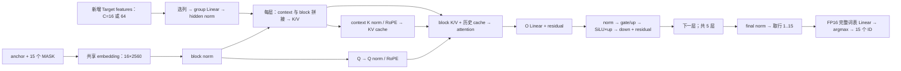

# 量化 Draft 架构与优化分析

审查基线：`feature/gdr-chunk-verify@2533557`（r37），分析日期 2026-09-20。
本项保留在开发分支，验证通过后再合并到 main。
本文是给算子开发和模型集成人员的需求分析；[具体 I/O 与精度要求](OPERATORS.md)、
[验收方法](VALIDATION.md)、[形状及观测数据](workloads.json)配套使用。

## 1. 结论与证据范围

最值得优化的是 **group-128 的 gate/up、down 矩阵乘，以及固定权重的重复格式转换**。
W4 还应消除每次调用时整张权重展开为 INT8 的过程。完整词表 LM head 是第二个独立热点。
“低比特权重”并不保证比 FP16 快：当前激活仍为 FP16，W4 还先展开成 INT8；
压缩节省的是权重存储，能否提速取决于解包、反量化、布局与 GEMM 数据流。

数据来自用户提供的 Ascend310P / CANN 9.0.0 / torch_npu
`2.8.0.post1+gitc7b6b32` 日志。全模型对比目录为 `gdr-lengths-waw8h36d`；
W8 msprof 的原始 CSV、OM 哈希、驱动版本和功耗状态未随表格提供。
因此下面是已观察热点和优化顺序，不能作为同源、十次稳定测量的正式性能验收。
尚无 W4 单算子 profile，不能把 W4 比 W8 多出的全部时延归因于解包。

| 当前实现 | Draft ms/call | Verify ms/call | token/投机轮 | 模型生成加速比 vs 普通 |
|---|---:|---:|---:|---:|
| FP16 | 20.22 | 51.14 | 3.92 | 1.59× |
| W4A16 | 94.68 | 51.38 | 3.65 | 0.77× |
| W8A16 | 63.52 | 51.25 | 3.93 | 1.03× |

这里的加速比是 `sum(普通 Prefill + Decode) / sum(DFlash Prefill + Decode)`，
不含加载、分词、重置、文本解码、写文件；既不是完整请求墙钟，也不是仅 Decode。
`Draft ms/call` 是同步 OM 调用时间；msprof 的算子耗时和它也不是同一口径。
两种模式各自生成输出，`PASS_WITH_DIFFERENCES` 保留输出不一致，任务准确率未评估。
完整结果见[结果文档](../../../docs/DFLASH_CURRENT_USAGE_AND_RESULTS.md)。

## 2. 当前 Draft 实际做了什么

生产实现为 [DraftGraph / PackedDraftLayer](../../python/qwen35_dflash/ascend310p/incremental.py)，
量化存储见 [GroupQuantLinear](../../../models/dflash_v1/draft_quantization.py)，
原生调用见 [weight_quant_linear](../../../models/dflash_v1/weight_quant_matmul.py)。

| 项目 | 已测量化 Draft | FP16 Draft |
|---|---:|---:|
| 层数 | 5 | 6 |
| hidden H | 2560 | 2560 |
| MLP intermediate I | 9728 | 9216 |
| 选定 Target feature 宽度 | 12800 | 20480 |
| Q / KV heads；head_dim | 32 / 8；128 | 32 / 8；128 |
| block 行数 / 最多候选 | 16 / 15 | 16 / 15 |
| Draft head | 共享 Target 的完整 FP16 head，词表 248320 | 相同词表 |

W4 和 W8 是各自发布的五层 checkpoint，不能将此对比解释成同一六层模型只改变 bitwidth。
统一 Target feature 输出宽度为 28160，Draft 按 checkpoint 的 `target_layer_ids` 选列，
不得省略、调换或重新训练这些特征。具体层类型、滑窗和 norm 参数仍以锁定 config 为准。

同一份 FC 结果供五层分别生成上下文 K/V，context 支路不依赖上一层 block hidden。
每层 K/V 已合并为一次投影，gate/up 也已合并，不能再把这些融合算作新收益。
cache 只提交 Target 确认过的上下文；block 内 K/V 是临时值。零接受也处理旧 anchor。
block 的 16 行包括 anchor，即使本轮只请求少量候选，当前 OM 仍计算 16 行，最后遮掉无效输出。

每次 Draft 有 `1 + 5×5 = 26` 个 WeightQuant 调用：

| 投影 | 每次调用数 | X `[M,K]` | 逻辑 W `[N,K]` | scale `[G,N]` | Y `[M,N]` |
|---|---:|---|---|---|---|
| FC | 1 | `[C,12800]` | `[2560,12800]` | `[100,2560]` | `[C,2560]` |
| K/V 合并 | 5 | `[C+16,2560]` | `[2048,2560]` | `[20,2048]` | `[C+16,2048]` |
| Q | 5 | `[16,2560]` | `[4096,2560]` | `[20,4096]` | `[16,4096]` |
| O | 5 | `[16,4096]` | `[2560,4096]` | `[32,2560]` | `[16,2560]` |
| gate/up 合并 | 5 | `[16,2560]` | `[19456,2560]` | `[20,19456]` | `[16,19456]` |
| down | 5 | `[16,9728]` | `[2560,9728]` | `[76,2560]` | `[16,2560]` |

`C=16/64`，故 K/V 的 M 为 32/80；用户给的 profile 是 C=64 这一档。
生成稳态通常为 C=16，不能把 C=64 单次 profile 的所有开销等比例套用。
FP16 LM head 另外调用一次，不包含在上述 26 次里。

## 3. W8 热点分解

| 算子 / 投影 | 次数 | 累计 ms | 占该次 profile |
|---|---:|---:|---:|
| gate/up WeightQuant | 5 | 20.854425 | 33.28% |
| down WeightQuant | 5 | 8.351121 | 13.33% |
| O WeightQuant | 5 | 3.550026 | 5.67% |
| Q WeightQuant | 5 | 3.022135 | 4.82% |
| FC WeightQuant | 1 | 2.329088 | 3.72% |
| K/V WeightQuant | 5 | 2.117031 | 3.38% |
| 全部 TransData | 27 | 10.445810 | 16.67% |
| FP16 LM head MatMul | 1 | 6.729375 | 10.74% |
| 其他算子 | — | 5.255445 | 8.39% |
| 总计 | — | 62.654460 | 100% |

投影明细求和与总表有微小四舍五入差异；WeightQuant 总表为 40.223830 ms。
gate/up + down 合计 **29.205546 ms / 46.61%**。gate/up 单次约 4.17 ms，down 约 1.67 ms。
权重 `*_weight_nz*` 的 ND→NZ 是固定权重转换，五层重复调用仍再次执行。
27 个 TransData 中还可能有激活转换，不能将 10.45 ms 全部记为可消除的权重开销。

gate/up 的 `vec_ratio≈0.53`、`scalar_ratio≈0.45`、`mac_ratio≈0.008` 支持调查反量化、
循环组织和数据搬运；这些流水计数会重叠，不能相加成耗时。
也不能据 `cube_utilization≈93%` 认定 Cube 算力已饱和。当前没有匹配此设备的能力画像，
不据这些百分比承诺硬件极限或可实现倍数。

## 4. 按收益来源拆分工作

| 顺序 | 工作 | 可以消除什么 | 精度/兼容性与当前状态 |
|---|---|---|---|
| 1 | 固定 W8 权重离线 NZ、修复动态图常量边界 | 每轮固定权重 TransData | 字节重排应完全可逆；r37 静态编译通过，动态仍失败，尚无运行收益 |
| 1 | W4 解包与布局合并，或直接 tile 内解包做 Linear | 整张 INT8 中间权重及其再次 NZ 转换 | code 必须逐个相同；专用需求 A/B 见 OPERATORS |
| 2 | 小 M 的 W8/W4 group-128 Linear，先 gate/up 与 down | 26 次原生算子内解包/反量化、读权重及调度开销 | 数学相同不保证舍入相同；同 checkpoint 原生 OM 为数值基线 |
| 3 | 只建上下文缓存的 prefill 图 | 准备调用中被丢弃的候选 Q/O/MLP/head | 属于图和调度改造，需缓存分支与数值验收；尚未实现 |
| 4 | 完整词表 Linear + Top-1 | 全 logits GM 落地、独立 argmax | 不缩减词表、不量化 head；独立需求 C |
| 5 | 最后层仅计算有最终消费者的行、小算子融合 | 部分死行和小中间量 | 需逐索引活性证明；attention/norm 总占比低，不是首轮主攻方向 |

**仅建缓存的机会：** 每个非最后的 64-token prompt 块会调用完整 Draft，候选输出被丢弃。
1024-token prompt 有 15 次这样的准备调用。当前源码中 context KV 只依赖 projected features、
该层 K/V 权重、K norm、RoPE、位置和旧 cache，因此候选 Q、attention、O、MLP、head 对这些
准备调用的最终 KV 没有数据依赖。候选方案可只保留 FC/norm 和各层 context K/V 更新。
不过原融合 K/V 的 M 从 80 改成 64 可能改变内核及舍入，且必须保持 valid_rows、逻辑 cursor、
全部物理 cache 写入和 current/next 所有权；不能只凭“候选被丢弃”宣称整图已等价。
额外 OM 的常驻权重/工作区也要计入，避免复制整套权重抵消低显存收益。

**行活性边界：** LM head 原本已经只计算 MASK 行 1..15，anchor 的 head 计算已省掉。
最后一层 Q/O/MLP 的 anchor 行可能进一步省掉；最后层 block K/V 中的 anchor 仍被其他 query 使用。
更早层的 anchor hidden 会生成后续层 K/V，也不能删。非因果层之间可能存在 MASK 行间依赖，
少请求几个候选不等于可以直接删掉所有层的对应行；必须沿完整 mask/消费者图证明。

**不作为本轮默认方案：** 动态 A8 激活量化、W4/W8 重量化、group-128 改 per-channel、
减层/减宽、候选词表 Top-K 裁剪、近似 SiLU。这些改变数值或模型契约，不能用“至少提速”
代替精度方案和用户确认。可逆的离线重排已获用户授权；本目录只提出需求，未部署新的路径。

## 5. 1.5–4 倍应如何理解

以当前 FP16 Draft 20.22 ms 为参照，Draft 单次快 1.5× / 4× 要分别达到 **13.48 / 5.055 ms**。
即使乐观地把这次 W8 profile 的全部 TransData 删除，也仅从 62.65 降到 52.21 ms，
约为 W8 自身的 1.20×，远没有追上 FP16。
若 head 仍为当前测得的 6.73 ms，单这一项就大于 5.055 ms，其他部分再快也达不到该条件下的 4×。

若讨论完整投机循环，在接受率、轮数和 Verify 耗时不变的条件下，
FP16 一轮约 `20.22+51.14=71.36 ms`；即使 Draft 耗时降到零，循环加速也只有
`71.36/51.14≈1.40×`。这是固定其他项时的算术限制，不能外推到接受率变化、prefill 改造
或 Verify 也被优化的情况。性能目标应分成“单算子”“单次 Draft”“模型生成”和“完整请求”
四项单独报告。当前数据支持继续优化，但不足以保证量化 Draft 比 FP16 快 1.5–4×。

## 6. r37 离线预打包的接收端状态

2026-09-20 用户提供 `matmul-atc-prepacked-r37/summary.json` 的终端摘要：

| 对照 | ATC | 观察 |
|---|---|---|
| prepacked-static16 | PASS | logical W `[64,256]`，physical NZ `[8,4,16,32]` 保持正确 |
| runtime-dynamic（16/64） | PASS | 原动态权重 + TransData 仍可编译 |
| prepacked-dynamic（16/64） | FAIL | 新增 `trans_TransData_1` 的 NZ→ND 源/目标都为 `[64,256]`，源 rank 应多 2 |

这次确认有 `const_output_shape_locked=true` 和 `descriptor=...v3`。
WeightQuant 已按 K=256 做推导，旧 `Ka[256] != Kb[32]` 错误已被跨过。
剩余错误是动态路径中格式转换的描述不匹配；E10052 的通用 AIPP 标题不能证明模型用了 AIPP。
需追踪插入的 NZ→ND 节点、父图 Const 到子图 Data 的边界描述，不能再盲目切换 group 或 NK/KN。
现有摘要没有该 TransData 完整前驱/后继，尚不能确定是哪一个 pass 插入、改错了哪份描述。

下一步从已保留的 GE dump 中对比上述转换插入前后，检查 shape、origin_shape、layout、
storage_shape/storage_format 以及常量字节数。修复需同时通过两档动态编译、静态对照、
OM 输出比较和 full Draft profile。不要设置 `IGNORE_INFER_ERROR=1` 绕过检查。
目前预打包数值、设备时延均 **NOT_RUN**；正常 FP16 和运行时 TransData 量化路径仍可使用。

## 7. 源码与文档参考

- 本仓库 [量化格式/加载](../../../models/dflash_v1/draft_quantization.py)、
  [原生调用](../../../models/dflash_v1/weight_quant_matmul.py)、
  [离线 NZ 字节排列](../../python/qwen35_dflash/ascend310p/weight_prepack.py)。
- [CANN 9.0.0 WeightQuant shape 检查源码](https://gitcode.com/cann/ops-nn/blob/fcebf031d193d641d2d1472a539bcc387b1e5f09/matmul/weight_quant_batch_matmul_v2/op_host/weight_quant_batch_matmul_v2_infershape.cpp)。
- [官方 torch_npu 接口文档](https://gitcode.com/Ascend/op-plugin/blob/master/docs/zh/custom_APIs/torch_npu/torch_npu-npu_weight_quant_batchmatmul.md)
  用于理解参数；该链接为 master，目标支持范围须与安装版本、上述 pinned 源码及接收端实测一起核对。
- [导出/编译与预打包操作](../../../docs/GDR_CHUNK_AIR_OM.md)。
