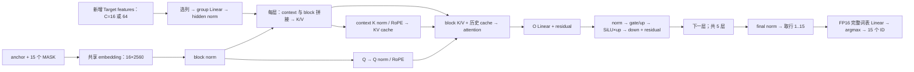

# 量化 Draft 架构与优化分析

优先开发 **小 M、group-128 的 W8A16 Linear**，先覆盖 gate/up、down，再扩展到其他投影。
第二步在该内核上融合 SwiGLU、残差；完整词表 Linear + Top-1 独立开发。
注意力融合优先级较低，长 prompt 的纯缓存构建则是单独的 Prefill 优化。

环境：Ascend310P / CANN 9.0.0；现有 profile 记录 torch_npu `2.8.0.post1+gitc7b6b32`。
测量来源为用户 benchmark 和 msprof，本文分析源码 `7792ce3`。
开发接口见 [算子需求](OPERATORS.md)，逐项验收见 [VALIDATION.md](VALIDATION.md)，
形状、字节数和测量来源见 [workloads.json](workloads.json)。

## 当前性能基线

离线 NZ W8、静态 C16/C64 OM、Chunk Verify、thinking 开、输出 128 token；
20 条输入，每条每模式预热 1 次、测量 3 次。来源：`gdr-lengths-mjhazgip`。

| 分组 | 接受率 | token/投机轮 | Draft ms/call | Verify ms/call | Decode 加速比 |
|---|---:|---:|---:|---:|---:|
| all，20 条 | 21.03% | 3.93 | 47.89 | 51.17 | 1.39× |
| short，8 条 | 21.20% | 3.98 | 47.54 | 51.13 | 1.41× |
| long，12 条 | 20.91% | 3.90 | 48.04 | 51.20 | 1.38× |

Decode 加速比为普通/DFlash 的 decode-loop 总时间比，不含 Prefill。
本次 DFlash Decode 为 3193.72 ms/次生成，Verify 累计为 1652.73 ms；
Draft 图累计 1977.69 ms **包含 Prefill 中的调用**，不能与 Verify 相加作为 Decode。
完整结果见 [测试结果](../../../docs/DFLASH_CURRENT_USAGE_AND_RESULTS.md#w8a16-离线-nz)。
`PASS_WITH_DIFFERENCES` 表示完成性能测量，尚未通过 ordinary token 一致性或任务质量验收。

## Draft 架构

实现见 [DraftGraph / PackedDraftLayer](../../python/qwen35_dflash/ascend310p/incremental.py)，
量化存储见 [GroupQuantLinear](../../../models/dflash_v1/draft_quantization.py)，
原生调用见 [weight_quant_linear](../../../models/dflash_v1/weight_quant_matmul.py)。

| 项目 | 已测量化 Draft | FP16 Draft |
|---|---:|---:|
| 层数 | 5 | 6 |
| hidden H | 2560 | 2560 |
| MLP intermediate I | 9728 | 9216 |
| 选定 Target feature 宽度 | 12800 | 20480 |
| Q / KV heads；head_dim | 32 / 8；128 | 32 / 8；128 |
| block 行数 / 最多候选 | 16 / 15 | 16 / 15 |
| Draft head | 共享 Target 的完整 FP16 head，词表 248320 | 相同词表 |

W4 和 W8 是各自发布的五层 checkpoint，不能将此对比解释成同一六层模型只改变 bitwidth。
统一 Target feature 输出宽度为 28160，Draft 按 checkpoint 的 `target_layer_ids` 选列。



同一份 FC 结果供五层分别生成上下文 K/V，context 支路不依赖上一层 block hidden。
每层 K/V 已合并为一次投影，gate/up 也已合并，不能再把这些融合算作新收益。
cache 只提交 Target 确认过的上下文；block 内 K/V 是临时值。零接受也处理旧 anchor。
block 的 16 行包括 anchor，即使本轮只请求少量候选，当前 OM 仍计算 16 行，最后遮掉无效输出。

每次 Draft 有 `1 + 5×5 = 26` 个 WeightQuant 调用：

| 投影 | 每次调用数 | X `[M,K]` | 逻辑 W `[N,K]` | scale `[G,N]` | Y `[M,N]` |
|---|---:|---|---|---|---|
| FC | 1 | `[C,12800]` | `[2560,12800]` | `[100,2560]` | `[C,2560]` |
| K/V 合并 | 5 | `[C+16,2560]` | `[2048,2560]` | `[20,2048]` | `[C+16,2048]` |
| Q | 5 | `[16,2560]` | `[4096,2560]` | `[20,4096]` | `[16,4096]` |
| O | 5 | `[16,4096]` | `[2560,4096]` | `[32,2560]` | `[16,2560]` |
| gate/up 合并 | 5 | `[16,2560]` | `[19456,2560]` | `[20,19456]` | `[16,19456]` |
| down | 5 | `[16,9728]` | `[2560,9728]` | `[76,2560]` | `[16,2560]` |

`C=16/64`，故 K/V 的 M 为 32/80；用户给的 profile 是 C=64 这一档。
生成稳态通常为 C=16，不能把 C=64 单次 profile 的所有开销等比例套用。
FP16 LM head 另外调用一次，不包含在上述 26 次里。

## 投影热点与剩余空间

下表是**离线 NZ 之前、C64 档**的 W8 单次 profile，用来定位投影；
当前离线 NZ OM 尚无新的单算子明细，不能将这些耗时当作 47.89 ms 的组成。

| 算子 / 投影 | 次数 | 累计 ms | 占该次 profile |
|---|---:|---:|---:|
| gate/up WeightQuant | 5 | 20.854425 | 33.28% |
| down WeightQuant | 5 | 8.351121 | 13.33% |
| O WeightQuant | 5 | 3.550026 | 5.67% |
| Q WeightQuant | 5 | 3.022135 | 4.82% |
| FC WeightQuant | 1 | 2.329088 | 3.72% |
| K/V WeightQuant | 5 | 2.117031 | 3.38% |
| 全部 TransData | 27 | 10.445810 | 16.67% |
| FP16 LM head MatMul | 1 | 6.729375 | 10.74% |
| 其他算子 | — | 5.255445 | 8.39% |
| 总计 | — | 62.654460 | 100% |

投影明细求和与总表有微小四舍五入差异；WeightQuant 总表为 40.223830 ms。
gate/up + down 合计 **29.205546 ms / 46.61%**。gate/up 单次约 4.17 ms，down 约 1.67 ms。
旧图的 `*_weight_nz*` 是固定权重转换。当前导出已经采用离线 NZ，不能再把旧图
10.45 ms TransData 当成下一轮优化收益；编译后剩余转换应以当前 OM 的 profile 为准。

26 个投影的 W8 权重共 **512.5 MiB**，FP16 group scale 共 **8.01 MiB**；
共享 FP16 LM head 单独为 **1212.5 MiB**。这些是逻辑张量大小，不是每轮实测 HBM 流量。
gate/up 与 down 是首选，原因是旧 profile 中约 29.21 ms 花在它们的反量化矩阵乘上，
而不是单独的 SiLU 或残差加法。仅将逐元素算子合并，不能省去这部分矩阵乘。

## 优化顺序

| 优先级 | 方案 / 需求编号 | 收益来源 | 实现要求 |
|---|---|---|---|
| P0 | A：小 M W8A16 group-128 Linear | tile 内反量化，跨 M 复用权重，流水预取和 GEMM 调度 | 直接读离线 NZ；先 gate/up、down，保持 q、scale 和数值边界 |
| P1 | D：W8 gate/up + SwiGLU | 在 A 上省去 gate/up 输出写回及重读 | 两个投影已合并，只新增激活融合；保留各 FP16 舍入边界 |
| P1 | C：完整词表 FP16 Linear + Top-1 | 避免全 logits 落 GM，按词表 tile 归约 | 所有词表列都计算；不能承诺减少 1212.5 MiB 权重读取 |
| P2 | E：W8 down + residual | 在 A 上省去 down 输出写回及重读 | 先将 Linear 结果舍入 FP16，再加 residual |
| P2 | F：分段 K/V 的 GQA Attention | 不复制整段 cache 来拼接 block，不将全 scores/probabilities 落 GM | 保留 QK/PV、FP32 Softmax、mask 和 cast 顺序 |
| 独立 Prefill 项 | G：仅更新 context KV 的图 | 删除候选分支的 Q/O/MLP/head 计算 | 新增图及 runtime 分发；不计入 Decode 收益 |

D/E 的矩阵乘收益与 A 重叠，不能分别相加；其额外收益是激活/残差融合。
F 的旧 QK/PV + Softmax 累计约 1.25 ms/次 Draft，因此本轮不优先重写 attention。
W4 专用的解包需求 B 保留供后续复用，不属于当前 W8 热点。

长 prompt 的非最后 64-token 块调用完整 Draft，但候选会被丢弃；1024-token prompt 有 15 次
这样的准备调用。context KV 只依赖 projected features、各层 K/V 权重、K norm、RoPE 和位置，
可用单独的缓存构建图复用 A，无需先写一个巨大的自定义融合算子。现有 `DraftContextGraph`
可参考，但它不是当前量化统一 feature/valid-row ABI 的直接替换。需求 G 给出具体边界。

其他代码层机会及限制：

- 若允许增加显存，可对热点离线生成 `FP16(q*S)` 权重，使用常规 FP16 GEMM 做性能对照。
  五层 gate/up+down 的 INT8 权重替换成 FP16，逻辑权重净增 356.25 MiB；若同时保留 INT8 则新增
  712.5 MiB。它不改变原始量化 code，却改变执行路径，须检查反量化舍入和数值，不能直接认定无损。
  此方案是显存换速度的备选，不是压缩权重常驻的 W8 自定义内核。
- 当前 INT16 控制量转 INT64 的两次 AI_CPU Cast，在旧 profile 中合计 0.60 ms。
  可评估统一 INT32 的位置/长度控制与 GE 导出方式；须同步改 ABI/runner 并确认索引范围，
  无需专门开发矩阵乘算子，也不能将它估成数倍提升。
- `proposal_count<15` 时大部分图仍执行 16 行。更少候选还会改变投机轮数、接受率；
  即使减少逻辑行，Cube 的物理 M tile 也未必减少，应按完整 Decode 对照。
- 第一层 MASK embedding 的 Q/K/V 投影具有重复输入，但 anchor 仍需投影，权重仍需读取；
  拆成 M=1 小 GEMM 可能损失复用，优先级低于 A。

LM head 已只计算 MASK 行 1..15。最后层 Q/O/MLP 的 anchor 行可分析是否省去；
block K/V 中的 anchor 仍被其他 query 使用，更早层的 anchor hidden 也参与后续 K/V。
裁减行前需检查完整消费者；M16→M15 也可能仍占同一个物理 tile。

## 收益预算

### 各算子省什么、还要付出什么

以下字节数按对应中间 Tensor 在 GM 写入、读取各一次计算；编译器已融合的部分不能再计收益。
每层内核的实际节省量记为 `δ = 原区域时间 - 新区域时间`，新区域包含布局适配、workspace
读写及新增启动。只有同输入原生 OM 配对测量才能得到 δ，目前均未测。

| 需求 | 可消除的工作 | 仍需执行 / 新增成本 | 单次完整 Draft 的时间节省 |
|---|---|---|---|
| A，先 gate/up、down | 低效的反量化、tile 搬运和调度；具体重读次数由 profile 确认 | 两类每层共 1,195,376,640 次乘加；五层 W8 权重 356.25 MiB、scale 5.57 MiB 仍需消费 | `5*δ_gate + 5*δ_down` |
| D，gate/up+SwiGLU | 投影结果往返 1,245,184 B/层，五层 6,225,920 B；独立激活调度 | 完整 gate/up GEMM 与 SiLU 仍在；成对 gate/up tile 增加片上占用 | `5*δ_swiglu`，相对 A+独立激活，仅计融合增量 |
| E，down+residual | down 结果往返 163,840 B/层，五层 819,200 B | down GEMM、R 读取及最终 hidden 写回仍在 | `5*δ_residual`，相对 A+独立 Add |
| C，LM head+Top-1 | 完整 logits 往返 14,899,200 B/调用、独立 ArgMax 调度 | 9,535,488,000 次乘加及 1212.5 MiB head 权重；分区最大值/ID 的归约和 workspace | `δ_head`，每次 Draft 一次；不能省掉完整 head GEMM |
| F，分段 attention | K/V 拼接结果往返 `8192*(L+16)` B/层；可进一步减少 scores/概率中间量 | QK/PV 仍共 `131072*(L+16)` 次乘加/层；Softmax；分块可能重读 K、重算 score | `5*δ_attention(L)`，须包含输入布局适配 |
| G，context-only 图 | 每个非末 C64 块删除 Q/O/gate/up/down 共 20 个量化投影及候选 head/attention；KV 的 M80→64 | FC+五层 context KV 共 6 个投影、norm/RoPE、完整 cache 输出；新增图的加载/常驻内存 | **Decode 为 0**；Prefill 为 `准备调用数*δ_context` |
| B，W4 解包+NZ | 若 ND INT8 中间量物化，省 `2*N*K` B/投影 | 读压缩 W4 `N*K/2` B，写 NZ `K1*N1*512` B，后续 GEMM 仍读 INT8；缓存需额外内存 | 当前 W8 为 0；W4 按其 26 个投影单独计量 |

D 还可能减少独立 SiLU 输出的写读，但不能在未看实际融合图时重复加算。
上述 D/E 中间量往返分别仅相当于对应 INT8 权重容量的 2.50%/0.66%；C 的 logits 往返
约为 FP16 head 权重容量的 1.17%。这解释了为何优先优化 GEMM 本身；这些容量比例不是时延比例。
F 中每个完整 FP32 scores 或 P32 Tensor 为 `2048*(L+16)` B，P16 为 `1024*(L+16)` B；
这些是容量，不能相加当作已节省流量。L 是部署 cache 容量，随有效 prompt 变短不会自动缩小。
分离 Attention 已避免 GQA 的 4 倍 KV 拷贝，不能再次宣称消除这一开销。

G 的 C64 量化乘加从 11,848,908,800 降到 3,774,873,600 次，并删除 head 的
9,535,488,000 次乘加；这不含 norm/attention 等计算。该图不再需要 Q/O/MLP 的
456.25 MiB W8 权重及 1212.5 MiB FP16 head，但正常 Draft 仍需保留它们，
因此这不是设备常驻内存的等量下降。新图的 FC/KV 权重共 56.25 MiB，若 OM 另存常量还会增加常驻。
G 对本组长输入每条替换 15 次准备调用，短输入为 0，全部输入平均为 9 次：
每次准备调用实测少 1 ms，则 long Prefill 少 15 ms、all Prefill 少 9 ms，Decode 不变。

### 从内核收益换算到 Decode

本次逐轮表三次测量共 1938 轮、60 次生成，平均每次生成 32.3 轮；每轮一个 Draft 和 Verify。
所有输入的最后 prompt 块均超过 16 行，第一次 proposal 用 C64，其余轮用 C16。
因此本组每次生成平均 **1 次 C64 + 31.3 次 C16** 在 Decode 内；额外平均 9 次 C64 准备调用在 Prefill 内。
调用数来自逐轮记录，不能用包含 Prefill 的 Draft 累计时间直接推算 Decode 节省量。

保持输出、接受轨迹、Verify 与调度不变，若完整 Draft 区域实测分别少 `δ64/δ16` ms：

```text
新 DFlash Decode = 3193.72 - (δ64 + 31.3*δ16) ms
相对当前 W8 的 Decode 提升 = 3193.72 / 新 DFlash Decode
相对 ordinary 的 Decode 加速比 = 4436.34 / 新 DFlash Decode
```

| 假设 C16/C64 每次 Draft 均减少 | 每次生成少用 | 新 Decode | 相对当前 W8 | 相对 ordinary |
|---|---:|---:|---:|---:|
| 1 ms | 32.30 ms | 3161.42 ms | 1.01× | 1.40× |
| 5 ms | 161.50 ms | 3032.22 ms | 1.05× | 1.46× |
| 10 ms | 323.00 ms | 2870.72 ms | 1.11× | 1.55× |

此表是投入目标的敏感性分析，**不是已实现或预计必达的性能**。
例如每层 gate/up 少 0.1 ms、down 少 0.1 ms，五层合计每轮少 1 ms，对应第一行；
单靠省去 SiLU/Add 的小中间量，不足以据此承诺整个 Draft 提速数倍。
A、D、E 必须按互不重叠的增量计，最终以组合 OM 和实际 Decode 的配对测量为准。

### Verify 固定时的预算

固定本次接受轨迹、Verify 图和调用次数，令 `T=3193.72 ms`、`V=1652.73 ms`。
把 `T-V` 的全部时间都视为可优化，得到**乐观预算**，不是实测预测：

| 非 Verify 部分缩短为 | 新 Decode 时间预算 | 相对当前 Decode 的理想时间比 |
|---|---:|---:|
| 1/2 | 2423.23 ms | 1.32× |
| 1/3 | 2166.39 ms | 1.47× |
| 0 | 1652.73 ms | 1.93× |

实际只能优化其中一部分，收益会更小；更改 Verify、接受率或调度后需重新建预算。
因此“Draft 算子 2×”不能写成“Decode 2×”。要让 **Draft 单次**比参考 FP16 的
20.22 ms 快 1.5×/4×，需分别达到 13.48/5.06 ms，当前证据不足以承诺。
两者 checkpoint 结构也不同，正式比较应固定输入并分别记录接受轨迹。

未取得与接收端匹配的带宽、计算峰值和片上容量证据，暂不给硬件理论下限。
`Block Num=8`、单个利用率字段也不足以证明算力饱和或存在可用空闲核。

[官方 WeightQuant API](https://github.com/Ascend/op-plugin/blob/master/docs/zh/custom_APIs/torch_npu/torch_npu-npu_weight_quant_batchmatmul.md)
将本路线定义为 FP16 激活与量化权重的反量化乘法；`inner_precise=1` 推荐场景是 INT32 承载权重等特定组合，
不是本 W8 INT8 路线的通用提速开关。W8A8 激活量化、词表裁剪、scale 改 per-channel 都会改变数值或模型，
不纳入这份无损替换需求。

首个开发交付建议只含 **A 的 gate/up、down 两个形状**及同输入原生 OM 对照；
通过数值和时延后再接入五层 Draft，再做 D/C。当前阶段仅完成分析和接口需求，未实现新 kernel。
