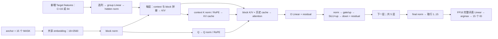

# 量化 Draft 架构与优化分析

环境：Ascend310P / CANN 9.0.0 / torch_npu `2.8.0.post1+gitc7b6b32`。
测量来源为用户 benchmark 和 msprof；完整对比见 [测试结果](../../../docs/DFLASH_CURRENT_USAGE_AND_RESULTS.md)。
开发接口见 [算子需求](OPERATORS.md)，形状与时延见 [workloads.json](workloads.json)。

## Draft 架构

实现见 [DraftGraph / PackedDraftLayer](../../python/qwen35_dflash/ascend310p/incremental.py)，
量化存储见 [GroupQuantLinear](../../../models/dflash_v1/draft_quantization.py)，
原生调用见 [weight_quant_linear](../../../models/dflash_v1/weight_quant_matmul.py)。

| 项目 | 已测量化 Draft | FP16 Draft |
|---|---:|---:|
| 层数 | 5 | 6 |
| hidden H | 2560 | 2560 |
| MLP intermediate I | 9728 | 9216 |
| 选定 Target feature 宽度 | 12800 | 20480 |
| Q / KV heads；head_dim | 32 / 8；128 | 32 / 8；128 |
| block 行数 / 最多候选 | 16 / 15 | 16 / 15 |
| Draft head | 共享 Target 的完整 FP16 head，词表 248320 | 相同词表 |

W4 和 W8 是各自发布的五层 checkpoint，不能将此对比解释成同一六层模型只改变 bitwidth。
统一 Target feature 输出宽度为 28160，Draft 按 checkpoint 的 `target_layer_ids` 选列。

同一份 FC 结果供五层分别生成上下文 K/V，context 支路不依赖上一层 block hidden。
每层 K/V 已合并为一次投影，gate/up 也已合并，不能再把这些融合算作新收益。
cache 只提交 Target 确认过的上下文；block 内 K/V 是临时值。零接受也处理旧 anchor。
block 的 16 行包括 anchor，即使本轮只请求少量候选，当前 OM 仍计算 16 行，最后遮掉无效输出。

每次 Draft 有 `1 + 5×5 = 26` 个 WeightQuant 调用：

| 投影 | 每次调用数 | X `[M,K]` | 逻辑 W `[N,K]` | scale `[G,N]` | Y `[M,N]` |
|---|---:|---|---|---|---|
| FC | 1 | `[C,12800]` | `[2560,12800]` | `[100,2560]` | `[C,2560]` |
| K/V 合并 | 5 | `[C+16,2560]` | `[2048,2560]` | `[20,2048]` | `[C+16,2048]` |
| Q | 5 | `[16,2560]` | `[4096,2560]` | `[20,4096]` | `[16,4096]` |
| O | 5 | `[16,4096]` | `[2560,4096]` | `[32,2560]` | `[16,2560]` |
| gate/up 合并 | 5 | `[16,2560]` | `[19456,2560]` | `[20,19456]` | `[16,19456]` |
| down | 5 | `[16,9728]` | `[2560,9728]` | `[76,2560]` | `[16,2560]` |

`C=16/64`，故 K/V 的 M 为 32/80；用户给的 profile 是 C=64 这一档。
生成稳态通常为 C=16，不能把 C=64 单次 profile 的所有开销等比例套用。
FP16 LM head 另外调用一次，不包含在上述 26 次里。

## W8 热点

| 算子 / 投影 | 次数 | 累计 ms | 占该次 profile |
|---|---:|---:|---:|
| gate/up WeightQuant | 5 | 20.854425 | 33.28% |
| down WeightQuant | 5 | 8.351121 | 13.33% |
| O WeightQuant | 5 | 3.550026 | 5.67% |
| Q WeightQuant | 5 | 3.022135 | 4.82% |
| FC WeightQuant | 1 | 2.329088 | 3.72% |
| K/V WeightQuant | 5 | 2.117031 | 3.38% |
| 全部 TransData | 27 | 10.445810 | 16.67% |
| FP16 LM head MatMul | 1 | 6.729375 | 10.74% |
| 其他算子 | — | 5.255445 | 8.39% |
| 总计 | — | 62.654460 | 100% |

投影明细求和与总表有微小四舍五入差异；WeightQuant 总表为 40.223830 ms。
gate/up + down 合计 **29.205546 ms / 46.61%**。gate/up 单次约 4.17 ms，down 约 1.67 ms。
权重 `*_weight_nz*` 的 ND→NZ 是固定权重转换，五层重复调用仍再次执行。
27 个 TransData 中还可能有激活转换，不能将 10.45 ms 全部记为可消除的权重开销。

## 优化顺序

| 优先级 | 方案 | 收益来源 | 实现要求 |
|---|---|---|---|
| 1 | 固定 W8 权重离线 NZ | 省去每轮固定权重 TransData | 可逆重排，保持逻辑 shape 与物理布局一致 |
| 1 | W4 tile 内解包，或解包与 NZ 转换融合 | 减少整张 INT8 中间量和格式转换 | 每个量化 code 完全相同；见算子 A/B |
| 2 | 小 M group-128 Linear，先 gate/up、down | 优化权重复用、反量化和 GEMM 调度 | 保留分组 scale 与基线舍入；见算子 A |
| 3 | 只建立上下文缓存的 Prefill 图 | 省去准备阶段被丢弃的候选计算 | 保持 KV、位置、有效行及缓存提交语义 |
| 4 | 完整词表 Linear + Top-1 | 省去全 logits 写回及独立 argmax | 保持 FP16 logits 和最小 ID tie 规则；见算子 C |

长 prompt 的非最后 64-token 块调用完整 Draft，但候选会被丢弃；1024-token prompt 有 15 次
这样的准备调用。context KV 只依赖 projected features、各层 K/V 权重、K norm、RoPE 和位置，
可尝试独立的缓存构建图。K/V 的 M 从 80 改为 64 后需验证舍入、缓存写入和下一轮输出，
并计入新增 OM 的常驻内存。

LM head 已只计算 MASK 行 1..15。最后层 Q/O/MLP 的 anchor 行可分析是否省去；
block K/V 中的 anchor 仍被其他 query 使用，更早层的 anchor hidden 也参与后续 K/V。
裁减行前需检查完整 attention mask 和消费者依赖。

以上方案保持 checkpoint、group-128 和 FP16 激活不变。W4 单算子瓶颈需单独 profile，
完整图收益按 [验收要求](VALIDATION.md)测量。
